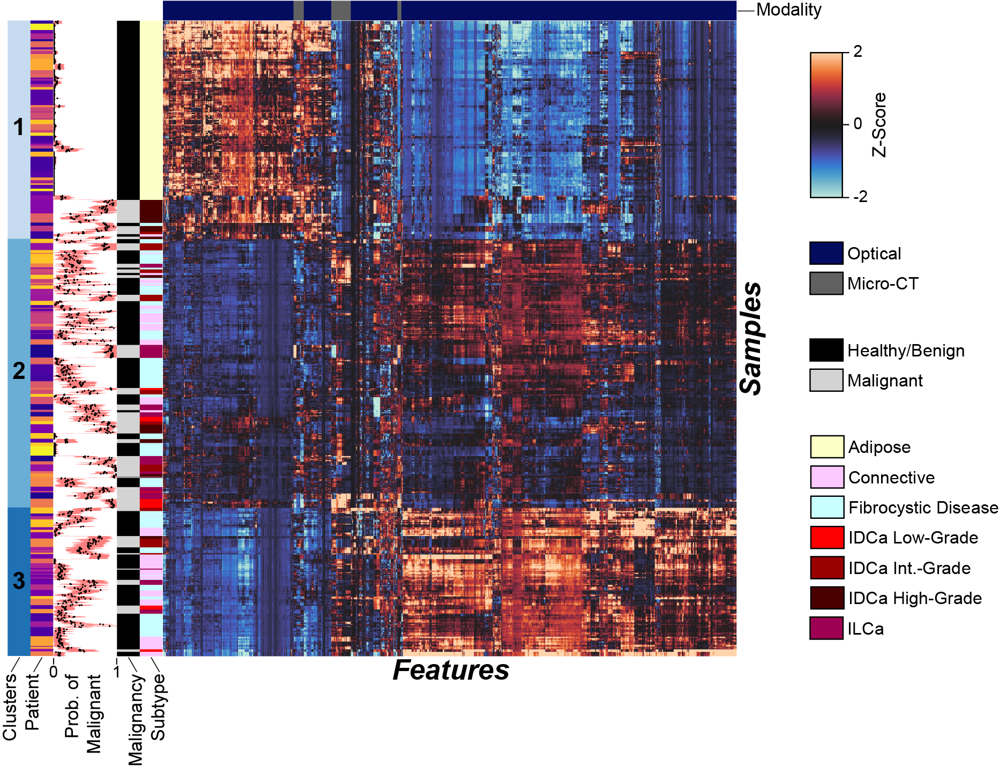

# Radiomics-Optomics of Breast Cancer
Streeter, S.S., Hunt, B., Zuurbier, R.A. et al. Developing diagnostic assessment of breast lumpectomy tissues using radiomic and optical signatures. _Sci Rep_ 11, 21832 (2021).

[Journal Link](https://doi.org/10.1038/s41598-021-01414-z)

The Python code in this repo requires downloading the data at the link below.

[Data Link](https://drive.google.com/file/d/1mo2XOcyw6GfnATgz1JIB-xWuufrCmqtJ/view?usp=sharing)

  <b>Supplementary Figure 2</b> 
  

## Issues
Please report all issues on the public forum.

## License
© [Optics in Medicine Lab](https://sites.dartmouth.edu/optmed/) - This code is made available under the GPLv3 License and is available for non-commercial academic purposes.

## Reference
If you find our work useful for your research, feel free to adapt our code and please consider citing our paper:
<pre><code>@article{streeter_radiomics_optomics_2021,
	title = {Developing diagnostic assessment of breast lumpectomy tissues using radiomic and optical signatures},
	url = {https://www.nature.com/articles/s41598-021-01414-z},
	doi = {10.1038/s41598-021-01414-z},
	language = {en},
	urldate = {2021-11-08},
	journal = {Scientific Reports},
	author = {Streeter, Samuel and Hunt, Brady and Zuurbier, Rebecca and Wells, Wendy and and Paulsen, Keith and Pogue, Brian},
	month = nov,
	year = {2021},
}
</code></pre>
